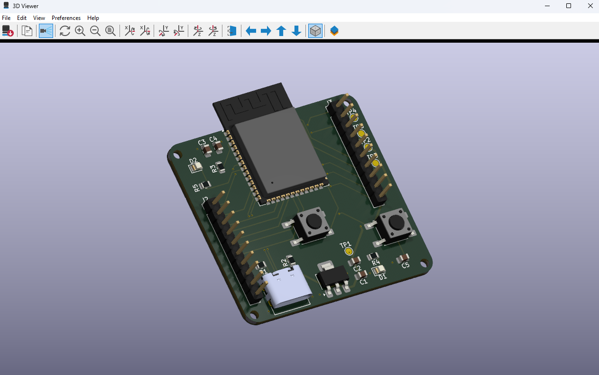

# ⚡ ESP32-S3 Custom Development Board

 

**A production-grade, 4-layer PCB development board built around the ESP32-S3-WROOM-1 module.**  
Designed for signal integrity, RF performance, and professional-grade hardware standards.

 

---

## 📋 Table of Contents

- [Overview](#-overview)
- [Key Features](#-key-features)
- [Technical Specifications](#-technical-specifications)
- [Advanced Hardware Design](#-advanced-hardware-design)
- [PCB Layer Stackup](#-pcb-layer-stackup)
- [Pinout & Peripherals](#-pinout--peripherals)
- [Repository Structure](#-repository-structure)
- [Manufacturing](#-manufacturing)

---

## 🔍 Overview

This project is an advanced, **production-ready development board** based on the **ESP32-S3-WROOM-1** module. It was designed with a focus on:

- ✅ **Signal Integrity** — Controlled impedance traces, optimized return paths
- ✅ **Power Stability** — Low-noise LDO regulation with proper decoupling
- ✅ **RF Performance** — Dedicated keep-out zone under the module antenna
- ✅ **Professional Standards** — 4-layer stackup, differential pair routing

This board is suited for makers, engineers, and students who want a reliable ESP32-S3 platform for IoT, wireless communication, sensor integration, or embedded systems development.

---

## ✨ Key Features

| Feature | Detail |
|---|---|
| 🧠 MCU | ESP32-S3-WROOM-1 — Dual-core Xtensa LX7, Wi-Fi 4 & BLE 5.0 |
| ⚡ USB | Native USB-C for programming and power |
| 🔋 Power | 5V input → 3.3V via AMS1117-3.3 LDO |
| 📡 RF | Keep-out zone for optimized antenna performance |
| 📐 PCB | 4-layer stackup for reduced EMI |
| 🔌 Headers | UART, I2C, SPI — fully broken out |
| 📊 ADC | 2× dedicated analog input channels |
| 🔴 LEDs | Power LED (D1) + User-programmable LED (D2) |
| 🔘 Buttons | RESET (EN) + BOOT (GPIO0) |
| 🧪 Test Points | 5V, 3.3V, GND, TX, RX (TP1–TP5) |

---

## 🛠 Technical Specifications

| Parameter | Value |
|---|---|
| Microcontroller | ESP32-S3-WROOM-1 |
| CPU | Dual-core Xtensa LX7 @ up to 240 MHz |
| Wireless | Wi-Fi 802.11 b/g/n (2.4 GHz) + BLE 5.0 |
| Flash | Built-in (varies by module variant) |
| Input Voltage | 5V DC via USB-C |
| Operating Voltage | 3.3V (regulated via AMS1117-3.3) |
| PCB Layers | 4 (Signal / GND / Power / Signal) |
| PCB Tool | KiCad 9.0 |
| USB Interface | Native USB (D+/D- differential pair) |
| Programming | USB-C (native), UART via test points |

---

## 🔬 Advanced Hardware Design

### 1️⃣ 4-Layer PCB & Signal Integrity

The board uses a **4-layer stackup** to deliver superior electrical performance.

By using dedicated internal planes for **GND** and **3.3V**, electromagnetic interference (EMI) is significantly reduced, and power distribution is stabilized across the entire board.

### 2️⃣ Differential Pair Routing (USB D+/D-)

The USB-C data lines are routed as **90-ohm controlled impedance differential pairs**:

- Matched trace lengths for minimal skew
- Consistent spacing to maintain target impedance
- Prevents signal reflection and ensures error-free high-speed data transmission

### 3️⃣ RF Keep-Out Zone

A dedicated **RF Keep-Out Zone** is defined beneath the ESP32-S3-WROOM-1 antenna region:

- No copper, traces, or components on **any layer** in this region
- Maximizes Wi-Fi and Bluetooth range
- Minimizes signal attenuation and multipath interference

### 4️⃣ Power Design — AMS1117-3.3 LDO

The **AMS1117-3.3** was chosen for its:

- Low dropout voltage (~1.2V typical)
- 800mA output current capability
- Excellent noise performance for RF applications
- Wide availability and low cost for prototyping

> ⚠️ **Note:** For battery-powered or low-power designs, consider a more efficient LDO (e.g., MIC5219 or TPS7A20).

### 5️⃣ Decoupling & Bypass Capacitors

- 100nF ceramic capacitors placed close to each power pin of the ESP32-S3 module
- Bulk capacitance at the LDO output for transient response
- Ferrite bead filtering on power input

---

## 📐 PCB Layer Stackup

| Layer | Type | Description |
|---|---|---|
| Layer 1 (Top) | Signal | Components, USB, buttons, LEDs |
| Layer 2 | GND Plane | Solid ground pour — EMI shield & return path |
| Layer 3 | Power Plane | Solid 3.3V pour — stable power delivery |
| Layer 4 (Bottom) | Signal | Additional routing |

---

## 🔌 Pinout & Peripherals

| Header | Signals |
|---|---|
| UART | TX, RX, GND, 3.3V |
| I2C | SDA, SCL, GND, 3.3V |
| SPI | MOSI, MISO, SCK, CS, GND, 3.3V |
| ADC | ADC_CH1, ADC_CH2, GND |
| GPIO | Spare GPIO pins for custom expansion |
| Test Points | TP1 = 5V · TP2 = 3.3V · TP3 = GND · TP4 = TX · TP5 = RX |

---

## 📂 Repository Structure

| Folder / File | Description |
|---|---|
| `Hardware/` | KiCad 9.0 project files (`.kicad_pcb`, `.kicad_sch`, `.kicad_pro`) |
| `Manufacturing/` | Production-ready Gerber, Drill, and POS files |
| `Images/` | High-quality 3D renders |
| `.gitignore` | Git ignore rules |
| `LICENSE` | MIT License |
| `README.md` | This file |

---

## 🏭 Manufacturing

The `/Manufacturing` folder contains all files needed for PCB fabrication, compatible with major manufacturers:

| Service | Notes |
|---|---|
| [JLCPCB](https://jlcpcb.com) | Recommended — affordable 4-layer PCBs |
| [PCBWay](https://www.pcbway.com) | Good quality, various finish options |
| [OSH Park](https://oshpark.com) | US-based, ENIG finish standard |

**Recommended fab settings:**

| Parameter | Value |
|---|---|
| Layers | 4 |
| PCB Color | Black (recommended) |
| Surface Finish | HASL or ENIG |
| Board Thickness | 1.6mm |
| Copper Weight | 1oz outer / 0.5oz inner |
| Min Trace/Space | 0.15mm |
| Min Hole Size | 0.3mm |

---

**Designed with ❤️ by [Azat KAYA](https://www.linkedin.com/in/azatkaya1/)**

*If this project helped you, consider giving it a ⭐ on GitHub!*

*If this project helped you, consider giving it a ⭐ on GitHub!*

